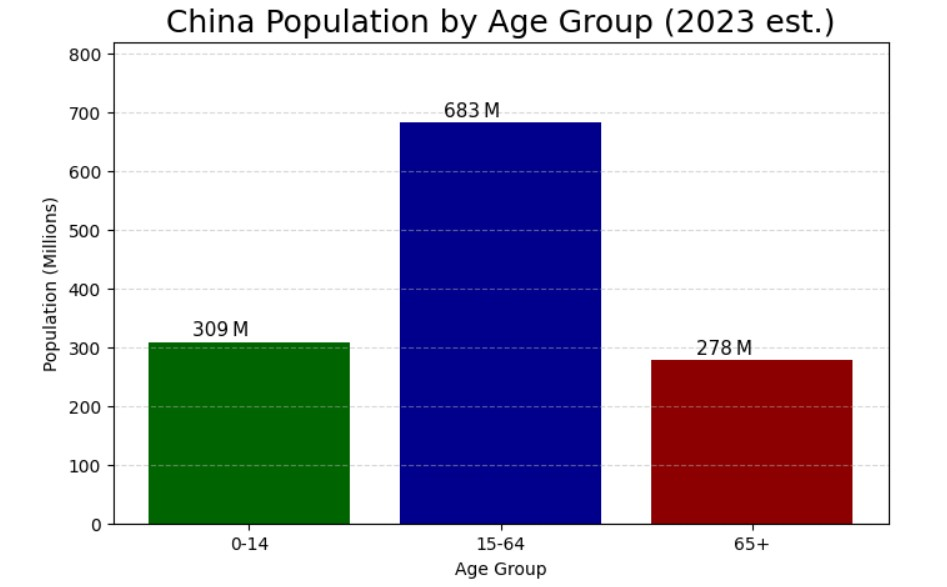

# 📊 China Population Analysis (2023 Estimate)

This project visualizes the distribution of China's population by age group based on the 2023 estimates using the `matplotlib` Python module.

## 📈 Visualization

The bar chart below illustrates the estimated population (in millions) across three major age groups:

- **0-14 years**: 309 million  
- **15-64 years**: 683 million  
- **65+ years**: 278 million  

### 🖼️ Chart: Population by Age Group

## 🛠️ Technologies Used

- Python 3.x
- [matplotlib](https://matplotlib.org/) – for data visualization

## 📂 Project Structure

